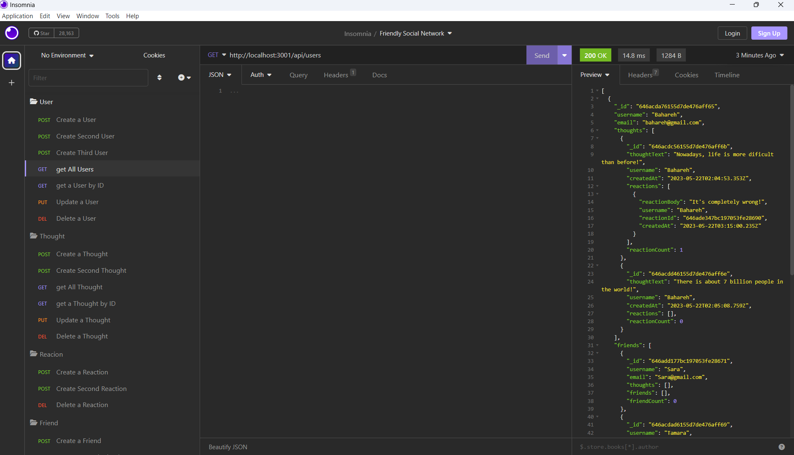

# Friendly Social Network

## Description 
---

It is an established fact these days that the usage of internet-base social media has become an inseperable part of the daily human life. The application here serves as a back-end for a social network web application. The users can be defined, they can share their thoughts, make a friends' list, and they can share their opinions about their friends' thoughts. 

 

3 schemas and 2 models are designed in this program:

1. a schema for user and a model based on that

2. a schema fot thought and a model based on that

3. a schema for reaction

 

The relationship between them is as follows:

- Each user can have multiple thoughts and each thought belongs to one user. (**one-to-many** relationship between the model of user and the model of thought)

- Each thought can have multiple reactions.

- Each user can have multiple friends. (**self-reference** relationship in the model of user)

 

This application can handle the following requests:

1. create a user

2. update a user

3. delete a user resulting in deletion of their thoughts and their id from the friends' list of the other users

4. get all users

5. get a user by its id

6. create a thought

7. update an existing thought

8. delete a thought resulting in deletion of its id from the thoughts' list of the related user

9. get all thoughts

10. get a thought by its id

11. create a friend

12. delete a frend

13. create a reaction to a thought

14. delete a reaction to a thought

15. show the friends' count of each user

16. show the reactions' count of each thought

 

## Table of Contents
---

* [Description](#description)

* [Mock Up](#mock-up)

* [Installation](#installation)

* [Usage](#usage)

* [Technology Used](#technology-used)

* [Questions](#questions)

* [Credit](#credit)

* [License](#license)

 

## Mock Up

---

### Requests in `'Insomnia'`

 

 

## Installation

---

In order to install this application, clone the repository and write the below command in terminal :

`npm i`

 

## Usage

---

To run the program, enter the below command in console, and then follow the instructions:

`node server.js` 

or

`npm start`

This is a link to a video which instructs the users on how to work with software : 

[Walk-through Video Link](https://drive.google.com/file/d/1iJx5OuzrL6czESgCfBogyavBqWlOl__C/view?usp=sharing)

 

## Technology Used

---

| Technology Used         |
| -------------           |
| JavaScript              |  
| Node.js                 |  
| Express.js              |
| MongoDB                 | 
| Mongoose Module         | 

 

## Questions 

---

If you have any additional questions, you can send me an email to :

[My Email Address](mailto:(mer_ir@yahoo.com))

 

## Credit

---

Name:     Bahareh Hosseini

Github page:      [https://github.com/Bhmerir](https://github.com/Bhmerir)

 

## License

---

MIT License

Permission is hereby granted, free of charge, to any person obtaining a copy
of this software and associated documentation files (the "Software"), to deal
in the Software without restriction, including without limitation the rights
to use, copy, modify, merge, publish, distribute, sublicense, and/or sell
copies of the Software, and to permit persons to whom the Software is
furnished to do so, subject to the following conditions:

The above copyright notice and this permission notice shall be included in all
copies or substantial portions of the Software.

THE SOFTWARE IS PROVIDED "AS IS", WITHOUT WARRANTY OF ANY KIND, EXPRESS OR
IMPLIED, INCLUDING BUT NOT LIMITED TO THE WARRANTIES OF MERCHANTABILITY,
FITNESS FOR A PARTICULAR PURPOSE AND NONINFRINGEMENT. IN NO EVENT SHALL THE
AUTHORS OR COPYRIGHT HOLDERS BE LIABLE FOR ANY CLAIM, DAMAGES OR OTHER
LIABILITY, WHETHER IN AN ACTION OF CONTRACT, TORT OR OTHERWISE, ARISING FROM,
OUT OF OR IN CONNECTION WITH THE SOFTWARE OR THE USE OR OTHER DEALINGS IN THE
SOFTWARE.

---

© 2023 Confidential and Proprietary. All Rights Reserved.
